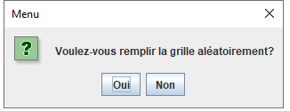

# BUT1-Algorithme-d-Ariane
Application codée en Java qui permet, à partir d'une grille imageant un labyrinthe, de trouver l'issue.

### Utilisation
**Comment lancer le programme ?**
Depuis un terminal à la racine du projet,  utiliser:
* __make run__ pour le premier programme

### Explications
**Que fait ce code ?**
Ce programme créé une grille symbolisant un labyrinthe (cases noires pour des murs, cases blanches pour des chemins empruntables).
La grille se crée en suivant un protocle précis:
* Le programme demande à l'utilisateur s'il souhaire utiliser une grille pré-éxistante. 
    * S'il répond oui, il doit choisir le fichier correspondant (vous trouverez des exemples dans le répertoire fichier/). Ces fichiers sont faits de manières à "coder" une grille en y indiquant la taille, la position de la sortie, de l'entrée, et des murs. Une fois le fichier choisi, la grille correspondante s'ouvre.
    * S'il répond non, on lui demande alors la taille de la grille, et s'il souhaite la remplir aléatoirement ou non.
        * S'il répond oui, tous les éléments (entrée, sortie et murs (le nombre de murs est aussi aléatoire) sont placés aléatoirement)
        * S'il répond non, l'entrée se positionne tout en haut à gauche, et la sortie tout en haut à droite. Il n'y a aucun mur
* Après l'ouverture de la grille, peut importe la manière, l'utilisateur peut la modifier. La modification passe par plusieurs états. Pour changer d'état, il suffit d'appuyer sur la barre espace.
    * Mur: Cliquer sur une case blanche la transforme en case noire, et inversement. NB: on ne peut pas cliquer sur l'entrée ou la sortie.
    * Entrée: Cliquer sur une case blanche (ne fonctionne pas sur une case noire) replace l'entrée
    * Sortie : Cliquer sur une case blanche (ne fonctionne pas sur une case noire) replace la sortie
    * Mur (On repasse par cet état pour le cas où l'utilisateur voudrait mettre un mur là où étaient initialement l'entrée et la sortie, case qui étaient bloquées lors du premier mode mur)
    * Fin: Fin des modifications
* Une fois les modifications terminées, le programme propose à l'utilisateur de sauvegarder la grille pour pouvoir la ré-ouvrir une autre fois.
* Viens ensuite la partie des algorithmes. Il en existe deux:
    * L'algorithme aléatoire, qui va aller dans l'une des cases au-dessus, en-dessous, à gauche ou à droite aléatoirement.
    * L'algorithme déterministe, qui va tester les différents chemins afin de trouver le plus court vers la sortie.
* Pour ces deux algorithmes, il y a deux modes d'éxécution:
    * Le mode automatique, qui va faire une centaine de tests si l'algorithme aléatoire a été sélectionné, et un seul s'il s'agit du déterministe. Tout cela, sans rien afficher à l'écran, mise à part un pop-up annonçant les résultats (le nombre de déplacement pour parvenir à la sortie)
    * Le mode manuel, où en appuyant sur la barre espace, l'algorithme avance d'une case selon sa fonction. Pour les deux algorithmes, une seule éxécution se fait.
* Après tout cela, le programme se ferme.

###  Annexes
* Choix de l'ouverture:
  * 

* Ouverture d'un fichier:
  * 

* Demande de la taille de la grille:
  * 

* Choix du remplissage aléatoire:
  * 

* Grille créée:
  * 

* Changement de mode:
  * 

* Grille modifiée après les changements:
  * 

* Choix de l'algorithme:
  *   

* Choix du mode:
  *     

* Avancée d'une case:
  * 

* Résulats de l'algorithme aléatoire en mode automatique:
  * 

* Résulats de l'algorithme déterministe:
  *   